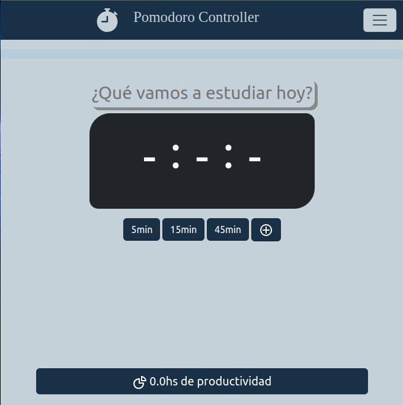
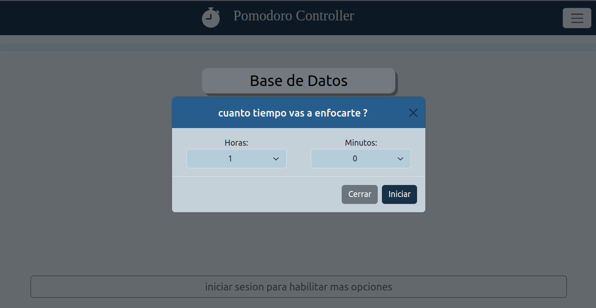
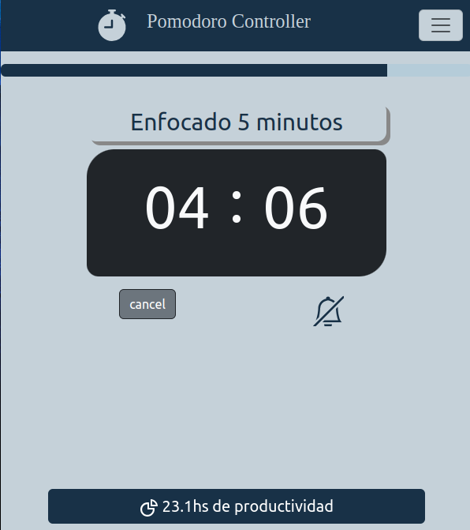
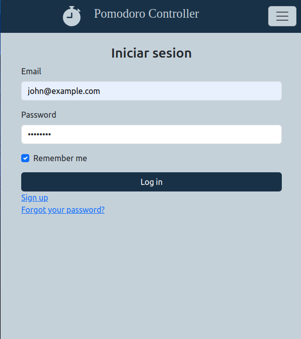
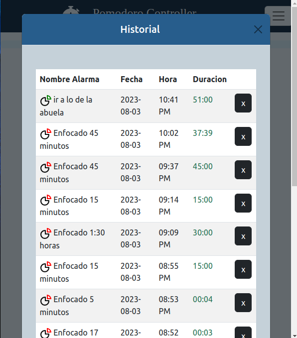

# Pomodoro Controller

Pomodoro Controller is a Ruby on Rails application with Bootstrap integration and a SQL database. The main objective of this application is to provide users with a time control system based on the Pomodoro technique. It allows users to set a name for each timer and customize the duration of each Pomodoro session.

## Features

- Pomodoro Timer: Users can create and start Pomodoro timers to manage their tasks efficiently.

- Task Naming: Each Pomodoro timer can be assigned a specific name to keep track of different activities.

- Historical Tracking: Registered users have access to a historical log of their previous Pomodoro sessions.

- Work Time Accumulation: Users' work hours are recorded and accumulated, providing insights into their productivity.

## Getting Started

Follow these steps to set up the Pomodoro Controller application:

1. Clone the repository: `git clone <repository-url>`

2. Install dependencies: `bundle install`

3. Set up the database: `rails db:create && rails db:migrate`

4. Start the server: `rails server`

5. Visit `http://localhost:3000/` in your browser.

## Usage

1. Register or log in with your username, email, and password to access the full functionality of the Pomodoro Controller.

2. Once logged in, you can create a new Pomodoro timer by providing a name and customizing the duration.

3. Start the timer, and the application will notify you when the Pomodoro session is complete.

4. Check your historical log to review past Pomodoro sessions and track your accumulated work hours.

## Methodology

The development of Pomodoro Controller follows the Agile Scrum methodology, which emphasizes iterative and incremental progress.

## Color Theme Swatches

The application uses the following color theme swatches in hexadecimal format:

- #183147 
- #C5D1D9
- #275D8C

- #B5CCD9
- #C25981
- #8F0A84
- #5D597A
- #51A34B
- #183147
- #3F6F8C
- #2C6673
- #BF946F

## Additional Resources

- Bootstrap Installation Guide For Your Proyect RoR: [Link](https://mixandgo.com/learn/ruby-on-rails/how-to-install-bootstrap)

---

Example Images:

1. Menu Principal - Usuario Registrado
   

2. Crear Cronometro Personalizado - Estudiar "Base de Datos" (1 hora)
   

3. Estudiar - Enfocado (5 minutos) - Cronometro Corriendo en 04:06
   

4. Menú Iniciar Sesión con Datos de "john@example.com"
   

5. Vista del Historial de Cronómetros de John - 9 Cronómetros con sus Datos
   

---

Keywords: Pomodoro, Timer, Precise, Time Management, Relaxing, Study, Productivity, Task, Efficiency, Focus, Motivation, Break, Work, Goal, Success, Planning, Focus Technique, Motivational Quotes, Time Tracking, Task Management

Palabras Clave: Pomodoro, Temporizador, Preciso, Gestión del Tiempo, Relajante, Estudio, Productividad, Tarea, Eficiencia, Enfoque, Motivación, Descanso, Trabajo, Objetivo, Éxito, Planificación, Técnica de Enfoque, Frases Motivadoras, Seguimiento del Tiempo, Gestión de Tareas

---
